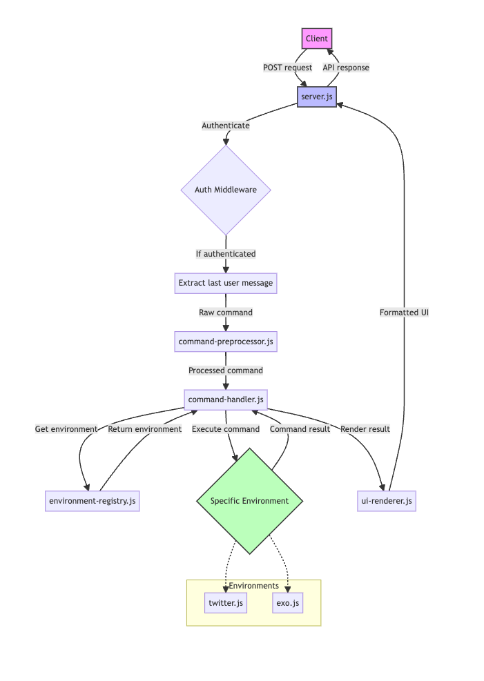

# Table of Contents

## Root

-   `server.js`: Main entry point. Sets up Express server, handles API requests, and orchestrates asynchronous command processing.

## src/

-   `command-handler.js`: Manages asynchronous routing of commands to appropriate environments and handles global commands.
-   `environment-registry.js`: Maintains registry of all available environments and their commands.
-   `ui-renderer.js`: Renders command results into a text-based UI format.

### src/environments/

-   `twitter.js`: Implements the Twitter environment with its specific commands (simulated functionality).
-   `exo.js`: Implements the Exo environment with integration to Claude API for advanced queries and analysis.

### src/middleware/

-   `command-preprocessor.js`: Preprocesses incoming commands. Placeholder for future LLM integration.

## Configuration

-   `.env`: (Not in repository) Contains environment variables such as API keys for external services.

## Documentation

-   `README.md`: Project overview, setup instructions, and usage guide.
-   `TOC.md`: This file, providing a structural overview of the project.
-   `flow-diagram.png`: Visual representation of the system's data flow and component interaction.

## Package Management

-   `package.json`: Defines project dependencies and scripts.
-   `package-lock.json`: Locks dependency versions for consistent installs.
